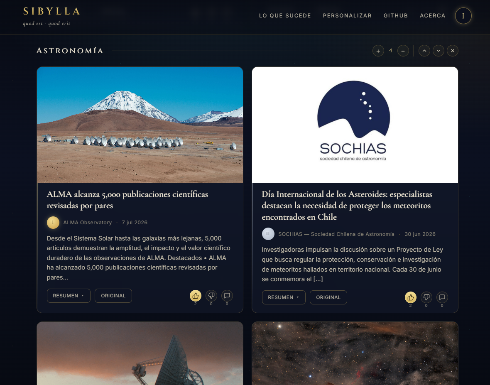

<div align="center">


# Sibylla

**Investigadora periódica de noticias.** Lee fuentes confiables, las filtra y rankea por confiabilidad, y produce un **resumen con enlaces a la fuente original** para profundizar.

[](#estado)
[](#instalación)
[](#uso)
[](LICENSE)
[](https://sibylla.cl)

</div>

---

Sibylla revisa cada cierto tiempo los temas que te interesan (**ciencia y tecnología**, más una **sección Nacional de Chile**) y te entrega un resumen ordenado. No republica el contenido: **detecta la noticia y enlaza a una fuente fiable**. El diseño es agnóstico de tema (se escala por configuración) y agnóstico de proveedor de IA (conectas la API que quieras, o ninguna).

<a name="estado"></a>
> **Estado:** prototipo funcional. La ingesta, el filtrado/ranking y el resumen (con o sin IA) funcionan. La **web estática multilingüe (4 idiomas)** está operativa y desplegada en **[sibylla.cl](https://sibylla.cl)**, con el contenido de las tarjetas traducido por IA al idioma de cada página. La **sección Nacional (Chile)** usa un juez LLM con corroboración cruzada y cuota regional. El despliegue y la automatización periódica están documentados ([DEPLOY.md](DEPLOY.md)); la entrega por email sigue en el roadmap.

## Tabla de contenidos

- [Características](#características)
- [Vista de la web](#vista-de-la-web)
- [Arquitectura](#arquitectura)
- [Instalación](#instalación)
- [Uso](#uso)
- [Configuración](#configuración)
- [Roadmap](#roadmap)
- [Notas](#notas)

## Características

- **Fuentes por confiabilidad (tiers), no por idioma.** Ingesta multilingüe; el resumen se entrega en tu idioma.
- **24 fuentes por defecto** (de **50** en el registro curado): APIs científicas (arXiv, PubMed), agregadores (Google News, Hacker News), 11 medios de ciencia/tecnología por RSS directo (Nature, BBC, MIT Tech Review, Phys.org, ScienceDaily, The Conversation, TechCrunch, Scientific American, Quanta, IEEE Spectrum, Agencia SINC) y la sección Nacional de Chile.
- **Sección Nacional (Chile).** 8 medios chilenos por RSS nativo (elegidos por **modelo de financiación**, no por línea editorial) más un agregador para los que no tienen feed. La selección es un **embudo de dos etapas**: pre-filtro heurístico (frescura + corroboración cruzada entre medios) → **juez LLM** que ordena por valor noticioso sin castigar la investigación exclusiva, con **cuota por medio y mínimo de tarjetas regionales**. Degrada con elegancia al top heurístico si no hay LLM.
- **Filtro de relevancia bilingüe** (ES/EN, sin tildes) y **deduplicación** por URL canónica / título.
- **Agrupación de misma historia entre medios** (near-dedup conservador por similitud de título): una noticia cubierta por varios medios se muestra una vez, con "También en: …" enlazando a los demás. Señal débil a propósito; prefiere no fusionar a fusionar de más.
- **Ranking** por `tier × frescura` y **diversidad** (una sola fuente no tapa al resto).
- **Resumen con IA opcional y multi-proveedor:** Anthropic (Claude), OpenAI, OpenRouter, cualquier endpoint compatible o **Ollama** (local). Sin LLM, genera una lista determinista.
- **Web estática monolingüe (español) con contenido localizado:** una sola página `index.html` enfocada en Chile. Los títulos y snippets de las tarjetas en otros idiomas se traducen al español con IA; cada tarjeta trae además un **botón "Resumen"** con un resumen en español generado por IA (abstract de papers, cuerpo de prensa extraído con trafilatura). Sin LLM, las tarjetas quedan en el idioma original de la fuente y sin botón de resumen.
- **X / Twitter opcional** con **tope de presupuesto mensual duro** (es de pago por uso), aislado en su propia sección de redes sociales.
- **Dashboard local de métricas:** `--dashboard` genera un panel con historial de ejecuciones y consumo/costo de tokens (lee `data/runs.json`).
- **SEO listo para producción:** favicons (con fondo transparente), `manifest`, `og:image`, `robots.txt` y `sitemap.xml`.

## Vista de la web

<div align="center">

</div>

> Estética grecorromana + sci-fi sobre el concepto "Lo que está sucediendo": una tarjeta por noticia, con sello de tier, enlace a la fuente y selector de cuántas tarjetas mostrar por tema.

## Arquitectura

```
 FUENTES                INGESTA               PROCESO                 SALIDA
┌──────────────┐   ┌────────────────┐   ┌──────────────────┐   ┌──────────────────┐
│ APIs (arXiv, │   │ fetchers.py    │   │ pipeline.py      │   │ digest.py /      │
│ PubMed)      │   │ normaliza a    │   │ dedupe + cluster │   │ summarize.py     │
│ Google News  │──▶│ NewsItem;      │──▶│ + rank +         │──▶│ -> Markdown      │
│ Hacker News  │   │ relevancia     │   │ diversify        │   │ (output/)        │
│ Medios RSS   │   │ por tema       │   │                  │   ├──────────────────┤
│ Nacional CL  │   └────────────────┘   ├──────────────────┤   │ web.py           │
│ X (opcional) │        │               │ nacional.py      │   │ -> HTML estático │
└──────────────┘   i18n.py +            │ (juez LLM +      │   │ (web/*.html)     │
                    locales/{es,...}    │  cuota regional) │   │ (solo español)   │
                    (traducciones)      └──────────────────┘   ├──────────────────┤
                   (traducciones)                              │ dashboard.py +   │
                                            IA opcional         │ metrics.py       │
                                            (llm.py)            │ -> métricas      │
                                                                └──────────────────┘
```

Cada ítem conserva su **URL de origen** y su **tier de confianza**. Ver [`config/README.md`](config/README.md) para el registro de fuentes y los tiers, y [AGENTS.md](AGENTS.md) para la estructura de módulos.

## Instalación

Requiere **Python 3.10+** (probado en 3.12).

```bash
python -m venv .venv
# Windows:  .venv\Scripts\activate     |  Linux/Mac:  source .venv/bin/activate
pip install -r requirements.txt
cp .env.example .env        # opcional: rellena claves (IA, X, etc.)
```

## Uso

```bash
# Por defecto: Nacional (Chile) + IA + medicina (lista determinista si no hay LLM)
python -m sibylla.cli

# Temas a la carta
python -m sibylla.cli --topics ai,medicine --max-per-source 8
python -m sibylla.cli --topics space --sources google_news_rss,arxiv_api

# Forzar solo lista (sin IA), o incluir X (DE PAGO, con tope de presupuesto)
python -m sibylla.cli --topics ai --summarize off
python -m sibylla.cli --topics ai --with-x

# Generar también la web estática (4 idiomas; tarjetas traducidas por IA si hay LLM)
python -m sibylla.cli --topics nacional,ai,medicine --html

# Dejar las tarjetas en el idioma original de la fuente (sin traducir contenido)
python -m sibylla.cli --topics ai,medicine --html --translate off

# Web + resumen Markdown en inglés
python -m sibylla.cli --topics space --lang en --html

# Dashboard local de métricas (historial de ejecuciones + costo de tokens)
python -m sibylla.cli --dashboard
```

El resumen se escribe en `output/digest-AAAAMMDD-HHMM.md`. La web se genera en `web/{index,es,en,it,pt}.html`.

Temas disponibles: `nacional, ai, computing, space, physics, biotech, medicine, neuroscience, climate, energy, general_science, general_tech`.

## Configuración

Toda la configuración sensible vive en `.env` (que **no** se sube al repo). Copia `.env.example` y rellena lo que necesites:

- **IA (opcional):** `LLM_PROVIDER` (`anthropic` / `openai` / `openrouter` / `openai_compatible` / `ollama`), `LLM_MODEL`, `LLM_API_KEY`, `LLM_BASE_URL`.
- **X / Twitter (opcional, de pago):** `X_BEARER_TOKEN` (+ claves). El tope mensual de lecturas vive en `config/sources.yaml` (`x_twitter.monthly_read_budget`) y el uso se cuenta en `data/x_usage.json`.
- **Idioma de salida:** `SIBYLLA_LANG` (`es`, `en`, `it`, `pt`). Si no se define, se usa `default_user_language` de `config/sources.yaml`. Fallback: `es`.
- **Sitio público:** `SIBYLLA_SITE_URL` (base para `og:image`, `sitemap.xml`, etc.). Fallback: `https://sibylla.cl`.
- **Otras (opcionales):** `NCBI_API_KEY`, `SEMANTIC_SCHOLAR_API_KEY`, `GUARDIAN_API_KEY`, `BLUESKY_*`.

Las fuentes se definen en [`config/sources.yaml`](config/sources.yaml) (registro curado por tiers).

## Roadmap

- [x] Ingestor (fetchers + normalización + dedupe + ranking)
- [x] Resumen con IA multi-proveedor (con fallback determinista)
- [x] Calidad: relevancia bilingüe, diversidad, URLs limpias de medios
- [x] Agrupación de misma historia entre medios (near-dedup por título; "También en")
- [x] Más fuentes (medios RSS + español + X con presupuesto)
- [x] Sección Nacional (Chile): juez LLM + corroboración cruzada + cuota regional
- [x] Web estática multilingüe (4 idiomas: es, en, it, pt) generada desde el pipeline
- [x] Despliegue en [sibylla.cl](https://sibylla.cl) + SEO (favicons, manifest, og:image, sitemap)
- [x] Dashboard local de métricas (ejecuciones + costo de tokens)
- [ ] Mejorar el near-dedup con una señal más fuerte (entidades / embeddings / LLM)
- [ ] Automatización periódica + entrega por email
- [ ] Resolver URLs de Google News (formato opaco actual) — mitigado con medios directos

## Notas

- **Seguridad:** nunca subas `.env` (tiene claves reales). Ver [AGENTS.md](AGENTS.md).
- **Tests:** lógica de dominio pura (URLs, relevancia bilingüe). Ver [TEST.md](TEST.md).
- **Licencia:** [MIT](LICENSE).
- Para contribuir o trabajar con agentes de IA, lee [AGENTS.md](AGENTS.md).
</content>
</invoke>
