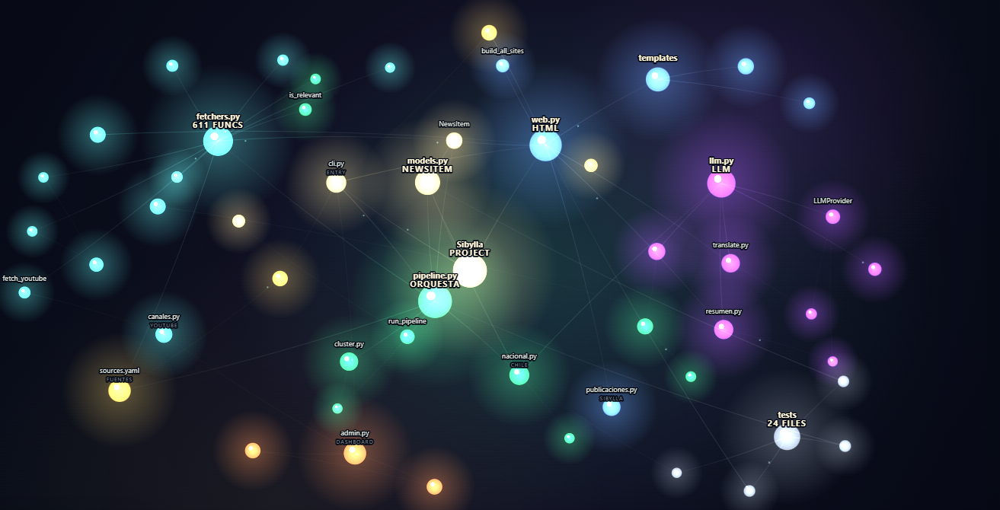

<div align="center">


# Sibylla

**Lectora periódica de noticias.** Selecciona con reglas públicas, resume en español y enlaza siempre a la fuente original.

[](https://sibylla.cl)
[](#instalación-y-uso)
[](TEST.md)
[](LICENSE)
[](https://sibylla.cl)

</div>

---

Elegir qué leer se volvió un trabajo: portadas ordenadas por el clic, la misma historia repetida diez veces y criterios de selección que ningún lector puede inspeccionar. Sibylla toma el camino contrario: es un agregador donde **todas las reglas de selección son públicas**. Qué fuentes usa y por qué, cómo las rankea, cuándo interviene una IA y con qué límites — está escrito en este repositorio, para que cualquiera pueda auditarlo, discutirlo o proponer cambios.

Cada mañana, Sibylla lee un centenar de fuentes — papers, agencias espaciales, prensa de ciencia y tecnología, medios chilenos — descarta lo irrelevante y lo duplicado, y publica en **[sibylla.cl](https://sibylla.cl)** un tablero de tarjetas por tema: cada una con su sello de confiabilidad, un resumen en español y el enlace al original. **No republica contenido:** detecta la noticia y te lleva a quien la publicó.

> **Estado:** en producción y en desarrollo activo. El sitio se regenera solo, una vez al día, con GitHub Actions ([regenerate.yml](.github/workflows/regenerate.yml)).

<div align="center">

</div>

## Cómo decide qué mostrar

Las decisiones editoriales de Sibylla no son un algoritmo opaco: son reglas versionadas que se pueden leer.

- **Confiabilidad antes que popularidad.** Cada fuente tiene un tier (1 = primaria / peer-review, 2 = periodismo, 3 = agregadores y discusión) y el ranking pondera `tier × frescura`, con un límite de diversidad para que ningún medio tape al resto. El registro curado — 100 fuentes, 80 activas por defecto — vive en [`config/sources.yaml`](config/sources.yaml).
- **Medios chilenos elegidos por modelo de financiación, no por línea editorial.** La sección de actualidad nacional exige además corroboración cruzada entre medios; un juez LLM ordena por valor noticioso sin castigar la investigación exclusiva, con cuota por medio y espacio garantizado para prensa regional.
- **Reglas por sección, escritas.** Qué fuentes alimentan cada sección, cómo se eligen sus tarjetas y en qué orden: documentado regla por regla en [SECCIONES.md](SECCIONES.md).
- **Una historia, una tarjeta.** Deduplicación por URL canónica y agrupación de la misma noticia cubierta por medios distintos ("También en: …"), conservando como representante a la fuente más confiable.
- **La IA tiene un rol acotado.** Traduce, resume y ordena la sección nacional; nunca genera noticias y toda tarjeta enlaza al original. Es multi-proveedor (Anthropic, OpenAI, OpenRouter, cualquier endpoint compatible u Ollama local) y **opcional**: sin LLM, el pipeline degrada a listas deterministas y tarjetas en su idioma original.
- **Sin publicidad ni tracking.** La web es HTML estático. La personalización (intereses, orden de secciones, modo feed) vive en el navegador del visitante (`localStorage`), sin cuentas de por medio. Los votos y comentarios son opcionales y con límites anti-abuso; sus reglas de Firestore también están versionadas aquí ([firestore.rules](firestore.rules)).
- **Presupuestos duros para lo que cuesta dinero.** X/Twitter es de pago por uso: tope mensual de lecturas y caché diaria. Traducciones y resúmenes por IA se cachean para no gastar tokens dos veces.

## Secciones

| Sección | Qué muestra |
|---|---|
| **Actualidad en Chile** | Prensa nacional: 8 medios por RSS nativo más un agregador, con juez LLM y corroboración cruzada. |
| **Frontera Digital** | Inteligencia artificial, computación y ciberseguridad. |
| **Medicina** | Papers (PubMed, arXiv) y prensa de salud y biomedicina. |
| **Astronomía** | Instituciones chilenas (ALMA, CATA, SOCHIAS) y agencias espaciales (NASA, ESA, JAXA…), más la foto astronómica del día. |
| **Divulgación** | El video más reciente de canales de divulgación científica en español (YouTube). |
| **SIBYLLA** | Publicaciones propias del sitio (Markdown en [`publicaciones/`](publicaciones/)). |
| **Voces de la red** | Mastodon, Bluesky y X: lo que se comenta, con lentes temáticas rotativas. |

## Cómo funciona

<div align="center">

</div>

> Grafo real de módulos del proyecto: `fetchers.py` normaliza cada fuente a un modelo común (`NewsItem`), `pipeline.py` orquesta (dedupe → cluster → rank → diversify) y `web.py` renderiza el sitio estático. Versión interactiva en [`docs/codebase-graph.html`](docs/codebase-graph.html).

Es Python sin frameworks: ~7.000 líneas en 24 módulos. Cada fuente tiene su fetcher y **falla de forma aislada** (una API caída jamás rompe la corrida). La capa LLM usa `requests` puro, sin SDKs de proveedor. Los 533 tests cubren la lógica de dominio pura y corren en ~1 segundo, sin red.

La estructura de módulos, las convenciones y las guías para extender (temas, fuentes, secciones, proveedores LLM) están en [AGENTS.md](AGENTS.md).

## Instalación y uso

Requiere **Python 3.10+** (probado en 3.12).

```bash
python -m venv .venv
# Windows:  .venv\Scripts\activate     |  Linux/Mac:  source .venv/bin/activate
pip install -r requirements.txt
cp .env.example .env        # opcional: claves de IA, X, etc.
```

```bash
# Resumen Markdown en output/ (con IA si hay clave; lista determinista si no)
python -m sibylla.cli

# Temas a la carta
python -m sibylla.cli --topics ai,medicine --max-per-source 8

# Generar la web estática (web/index.html, en español)
python -m sibylla.cli --topics nacional,ai,medicine --html

# Incluir X (DE PAGO, respeta el tope mensual)
python -m sibylla.cli --topics ai --with-x

# Herramienta admin local: /metricas (historial + costo de tokens) y
# /divulgacion (gestión de canales de YouTube)
python -m sibylla.cli --dashboard
```

Temas disponibles: `nacional, ai, computing, space, physics, biotech, medicine, neuroscience, climate, energy, general_science, general_tech` (más las secciones curadas `astronomia` y `divulgacion`).

## Configuración

Todo lo sensible vive en `.env` (ignorado por git; plantilla en `.env.example`):

- **IA (opcional):** `LLM_PROVIDER` (`anthropic` / `openai` / `openrouter` / `openai_compatible` / `ollama`), `LLM_MODEL`, `LLM_API_KEY`, `LLM_BASE_URL`.
- **X / Twitter (opcional, de pago):** `X_BEARER_TOKEN`; el tope mensual vive en `config/sources.yaml` (`x_twitter.monthly_read_budget`).
- **Otras (opcionales):** `NCBI_API_KEY`, `GUARDIAN_API_KEY`, `BLUESKY_*`, `YOUTUBE_API_KEY`.

Las fuentes y sus tiers se definen en [`config/sources.yaml`](config/sources.yaml); el registro está documentado en [`config/README.md`](config/README.md).

## Roadmap

- [ ] Señal más fuerte para agrupar la misma historia entre medios (entidades / embeddings / LLM)
- [ ] Entrega del resumen por email
- [ ] Resolver URLs opacas de Google News — mitigado con medios por RSS directo

## Notas

- **Seguridad:** nunca subas `.env` (claves reales). Ver [AGENTS.md](AGENTS.md).
- **Tests:** `python -m pytest tests/ -v` — lógica de dominio pura, sin red. Ver [TEST.md](TEST.md).
- **Despliegue:** guía genérica en [DEPLOY.md](DEPLOY.md).
- **Licencia:** [MIT](LICENSE).
